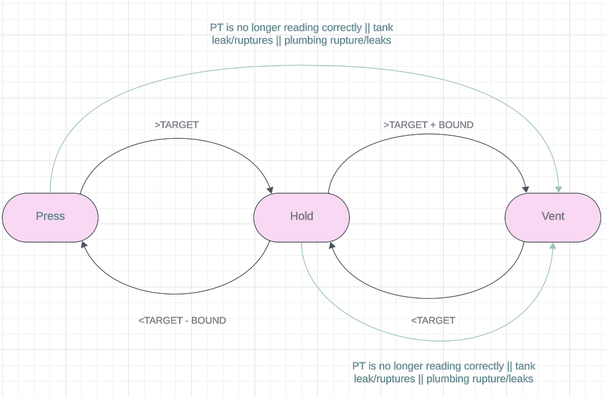
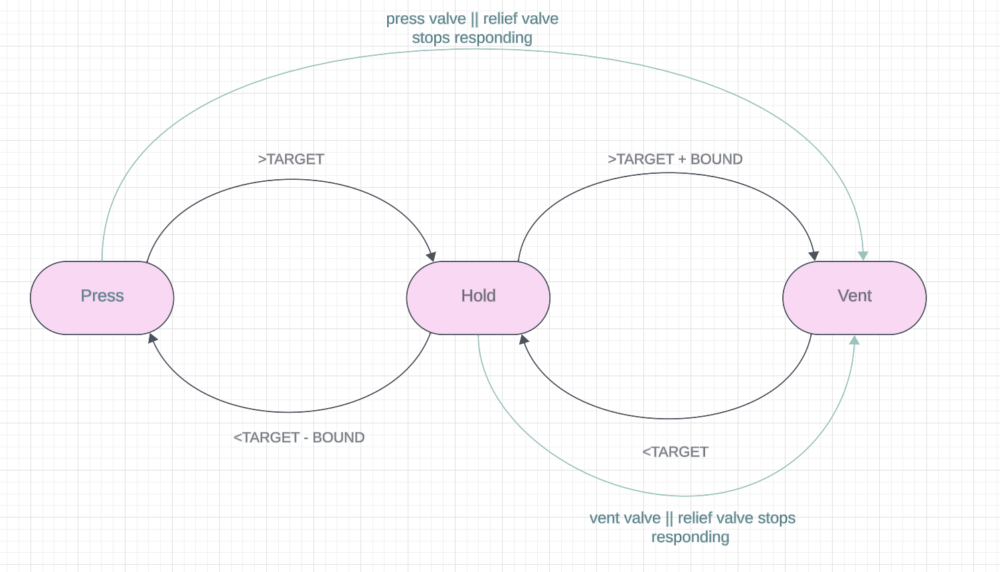
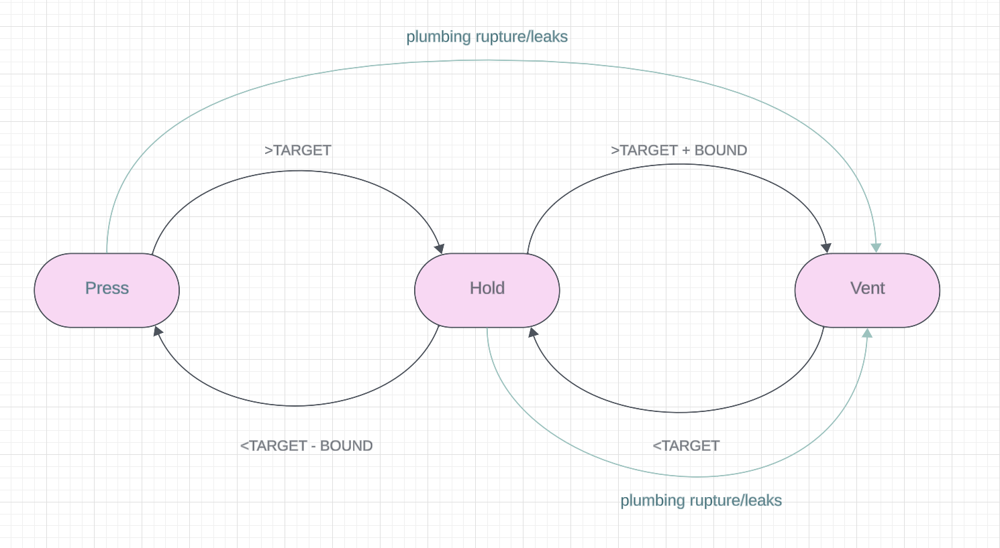

# 0 - Summary

A short summary. What is this and why are we writing it?

# 1 - Vocabularity

What terms may others be unfamiliar with? And what do they mean?

# 2 - Motivation

Detail - Why are writing this. 

# 3 - Requirements

# 4 - Design

- nominal state machine and failure cases

# Tank Autosequencing Notes 

_**Changing from COPV (composite overwrapped pressure vessel) to tanks instead._  
## Basic Failure/Anomaly Cases
1. When the _**pressure transducer (PT)**_ is no longer reading correctly, regardless of operational state (hold or press), the appropriate action is to close the press valve and open the vent valve 
   
2. In the event of the _**tank rupturing or leaking**_ above the press rate, close the press valve and open the vent valve. 

### 3. Valves stop responding 
- In the event that the _**press valve**_ stops responding, move directing to the vent state. 
  
- In the event that the _**relief valve**_ stops responding, move directly to the vent state by closing the press valve and opening the vent valve
   
- In the event that the _**vent valve**_ responding, close the press valve immediately 

## 4. Valve Leaks 
- In the event that the _**vent valve's**_ leak rate is faster than the press rate, open the vent valve to release all pressure 
  
- In the event that the _**relief valve's**_ leak rate is faster than the press rate, open the vent valve to release all the pressure 

5. In the event that the _**plumbing leak rate**_ is faster than the press rate, move directly to the vent state by closing the press valve and opening the vent valve 

