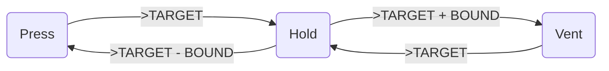
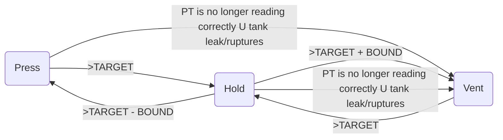
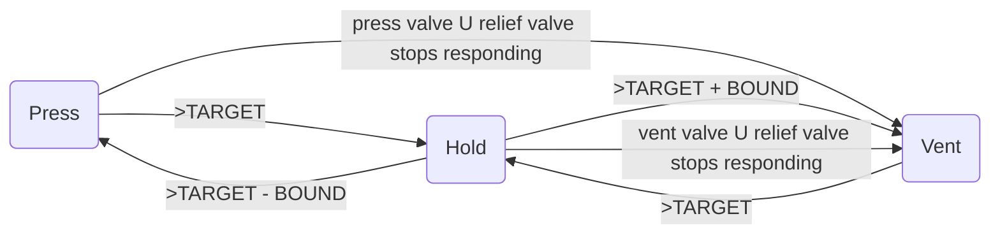

# Tank Autosequencing Notes 

**Changing from COPV (composite overwrapped pressure vessel) to tanks instead.

## Gas Booster to COPV 
- [Cristina's gooster document](https://docs.google.com/document/d/1zxNAvDeTis64uqNd1RQ0aw_zXKyjD137SSqlURlT-WM/edit)
- Cycle: Gas to gooster &rarr; compress &rarr; put in copv 
- leave for now 

## Basic Failure/Anomaly Cases
1. When the _**pressure transducer (PT)**_ is no longer reading correctly, regardless of operational state (hold or press), the appropriate action is to close the press valve and open the vent valve 
   
2. In the event of the _**tank rupturing or leaking**_ above the press rate, close the press valve and open the vent valve. 

### 3. Valves stop responding 
- In the event that the _**press valve**_ stops responding, move directing to the vent state. 
  
- In the event that the _**relief valve**_ stops responding, move directly to the vent state by closing the press valve and opening the vent valve
   
- In the event that the _**vent valve**_ responding, close the press valve immediately 

## 4. Valve Leaks 
- In the event that the _**vent valve's**_ leak rate is faster than the press rate, open the vent valve to release all pressure 
  
- In the event that the _**relief valve's**_ leak rate is faster than the press rate, open the vent valve to release all the pressure 

5. In the event that the _**plumbing leak rate**_ is faster than the press rate, move directly to the vent state by closing the press valve and opening the vent valve 

